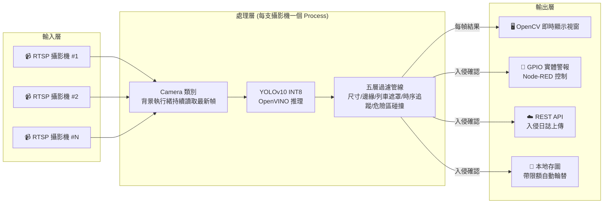
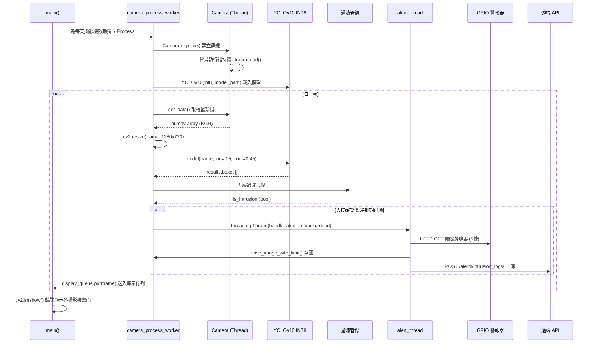
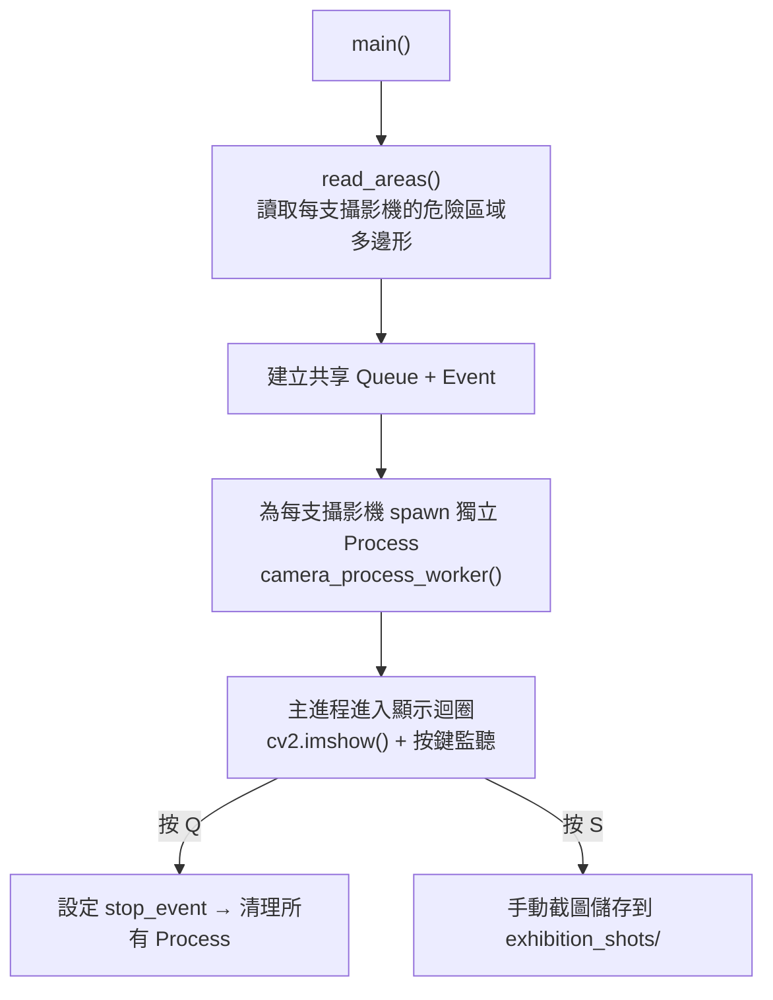
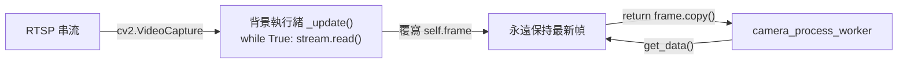
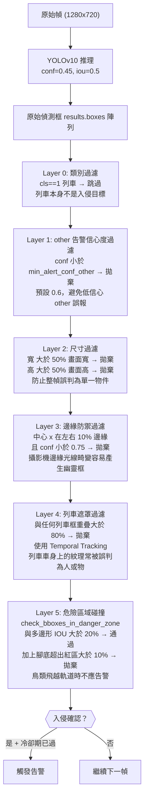
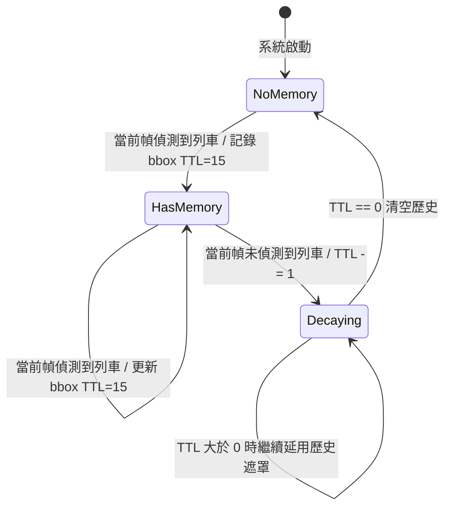
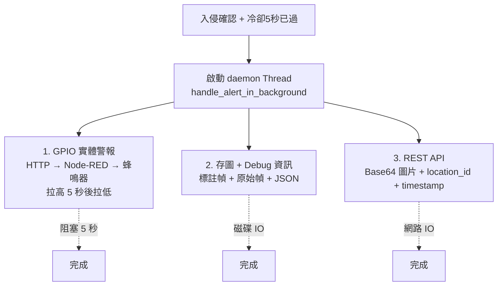
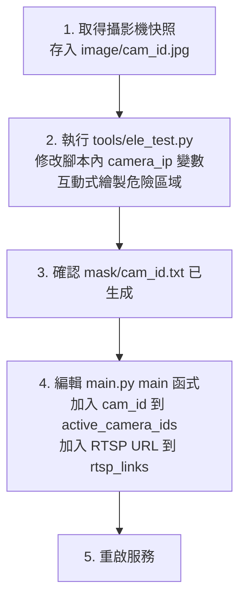
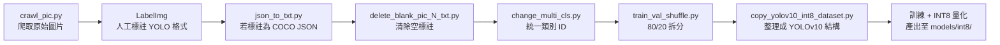

# 🚆 Rail Obstacle Detection System — 專案架構導讀

> **一句話定位：** 基於 YOLOv10 + OpenVINO INT8 量化的即時輕軌軌道外物入侵偵測系統，支援多路 RTSP 攝影機同步監控、多邊形危險區域碰撞判定，並透過 GPIO 實體警報與 REST API 進行即時告警。

---

## 第一階段：大局觀 (The Big Picture)

### 技術棧

| 層級 | 技術 | 版本/備註 |
|------|------|-----------|
| 語言 | Python | 3.x |
| 物件偵測 | YOLOv10 (THU-MIG) | 透過 `ultralytics==8.1.34` 載入 |
| 推理加速 | OpenVINO INT8 量化 | Intel 硬體最佳化 |
| 影像處理 | OpenCV | RTSP 串流擷取與影像渲染 |
| 幾何運算 | Shapely | 多邊形危險區域碰撞偵測 |
| 並行架構 | `multiprocessing.Process` | 每支攝影機一個獨立進程 |
| 串流讀取 | `threading.Thread` | Camera 類別內背景執行緒避免緩衝堆積 |
| 告警外發 | `requests` + `threading` | 非阻塞式 API 呼叫 + GPIO 觸發 |
| 模型版控 | Git LFS | 追蹤 `.pt`, `.xml`, `.bin` 大型檔案 |

### 為什麼選擇 YOLOv10？

YOLOv10 由清華大學（THU-MIG）團隊開發，相較前代最大的突破在於**消除了 NMS（Non-Maximum Suppression）後處理**，改採用 Consistent Dual Assignments 訓練策略，使推理時完全不需要 NMS，從而在邊緣裝置上獲得更低延遲。搭配 OpenVINO INT8 量化後，能在 Intel CPU/iGPU 上達到即時偵測效能——這對部署在軌道側無獨立 GPU 的嵌入式工控機至關重要。

### 系統架構圖



### 完整生命週期序列圖



---

## 第二階段：目錄結構與檔案分布

```
rail_obstacle/
├── main.py          # 🎯 唯一進入點：所有核心邏輯集中於此
├── camera.py                 # 📹 RTSP 串流封裝 (背景執行緒消費者模式)
├── install.sh                # 🚀 一鍵安裝部署腳本 (全新 Ubuntu → 運行中服務)
├── config.json               # ⚙️ 部署設定 (install.sh 互動式生成，亦可手動編輯)
├── requirements.txt          # 📦 Python 依賴宣告
├── README.md                 # 📖 使用說明與部署指南
├── docs/                     # 📚 架構文件 (本文件)
│   └── ARCHITECTURE.md
│
├── models/                   # 🧠 模型權重 (Git LFS 追蹤)
│   ├── rail_obstacle.pt      #    原始 PyTorch 權重
│   └── int8/                 #    ⭐ 正式運行使用的 INT8 量化模型
│       └── rail_obstacle_openvino_model/
│           ├── rail_obstacle.xml    # OpenVINO IR 網路拓撲
│           ├── rail_obstacle.bin    # OpenVINO IR 權重 (~2.3 MB)
│           └── metadata.yaml       # 模型元資料
│
├── mask/                     # 🔺 每支攝影機的危險區域定義
│   ├── {cam_id}.txt          #    多邊形頂點座標 (每行 x,y)
│   └── {cam_id}.jpg          #    危險區域視覺化預覽
│
├── image/                    # 📸 攝影機快照 (供 ele_test.py 繪製危險區使用)
│
├── datasets/                 # 📊 訓練資料集配置
│   └── rail_obstacle.yaml    #    YOLO 訓練用的 dataset YAML
│
├── saved_images/             # 💾 運行時偵測截圖 (自動輪替, .gitignore)
│   └── {YYYYMMDD}/          #    按日期分資料夾
│       ├── detected_cam{id}_{timestamp}.png   # 標註後的偵測圖
│       └── debug/            #    除錯資訊 (原始幀 + JSON metadata)
│
└── tools/                    # 🔧 離線工具腳本 (開發/部署用，不影響主程式)
    ├── ele_test.py            #    ⭐ 互動式危險區域繪製工具
    ├── crawl_pic.py           #    訓練圖片爬蟲
    ├── json_to_txt.py         #    COCO JSON → YOLO TXT 轉換
    ├── train_val_shuffle.py   #    資料集隨機 Train/Val 拆分
    ├── change_multi_cls.py    #    批次類別 ID 重新映射
    ├── delete_and_relabel_classes.py  # 刪除類別並重編號
    ├── delete_blank_pic_N_txt.py      # 清除空標註
    ├── delete_unmatched_jpgs.py       # 清除無標註圖片
    ├── generate_white_txt.py          # 生成空標註（負樣本）
    ├── move_dateset.py                # 批次搬移圖片/標註對
    └── copy_yolov10_int8_dataset.py   # 整理 INT8 量化用資料集
```

### 目錄職責總覽

| 目錄 | 職責 | 執行時期 |
|------|------|----------|
| `models/` | 存放訓練好的模型權重，`int8/` 子目錄為正式推理使用 | 運行時讀取 |
| `mask/` | 定義每支攝影機畫面中的「危險區域」多邊形座標 | 運行時讀取 |
| `image/` | 各攝影機的參考快照，用於離線標繪危險區域 | 開發/部署 |
| `datasets/` | YOLOv10 訓練用的資料集路徑配置 | 訓練時 |
| `saved_images/` | 運行時自動存放的入侵偵測截圖 + 除錯資訊 | 運行時寫入 |
| `tools/` | 一系列獨立的工具腳本，覆蓋從爬蟲到資料清洗的完整 ML Pipeline | 開發時 |

---

## 第三階段：核心邏輯導讀 (Follow the Path)

> **場景：系統啟動後，一個物體出現在軌道上的危險區域內，觸發警報。**

### 3.1 進入點：`main()` 函式

[main.py:380](file:///home/ubuntu/rail_obstacle/main.py#L380-L474)



**為什麼用多進程而非多執行緒？** Python 的 GIL (Global Interpreter Lock) 會阻止多執行緒真正平行執行 CPU 密集運算（如模型推理）。每支攝影機需要獨立執行 YOLO 推理，因此使用 `multiprocessing.Process` 來繞過 GIL 限制，讓每個進程擁有獨立的記憶體空間與 CPU 核心。

### 3.2 攝影機串流：`Camera` 類別

[camera.py](file:///home/ubuntu/rail_obstacle/camera.py)



**為什麼需要背景執行緒？** OpenCV 的 `VideoCapture` 內部有 RTSP 緩衝區。如果主迴圈因推理延遲而來不及讀取，緩衝區會堆積舊幀，導致畫面嚴重延遲。背景執行緒持續 `stream.read()` 消費緩衝區，使 `get_data()` 永遠返回最新幀，實現「跳幀取最新」的效果。

### 3.3 推理管線：YOLOv10 + 五層過濾器

[main.py:192-378](file:///home/ubuntu/rail_obstacle/main.py#L192-L378)

這是系統最核心的邏輯。每一幀經過 YOLO 推理後，不是直接取用結果，而是通過精心設計的**五層過濾管線**來消除誤判：



### 3.4 時序追蹤遮罩 (Temporal Tracking Mask)

[main.py:215-277](file:///home/ubuntu/rail_obstacle/main.py#L215-L277)



**為什麼需要時序追蹤？** YOLO 偵測存在幀間閃爍（flickering）問題：某一幀可能因光線或角度沒偵測到列車，但列車其實還在畫面中。如果此時列車車身上的紋理被偵測為「other」物件，而列車遮罩又恰好消失，就會產生誤報。`MAX_TTL=15`（約 1 秒 @ 15fps）提供了一個記憶緩衝期，讓列車遮罩在短暫消失後仍然有效。

### 3.5 告警處理：非阻塞式背景執行緒

[main.py:136-190](file:///home/ubuntu/rail_obstacle/main.py#L136-L190)



**為什麼用背景執行緒而非直接在工作進程中執行？** GPIO 警報需要持續拉高 5 秒，API 呼叫有網路延遲，存圖有磁碟 I/O。如果在主迴圈中同步執行，將導致當前攝影機的推理停滯 5+ 秒，錯失後續幀。使用 `daemon=True` 的背景執行緒確保告警操作不阻塞推理管線，且進程退出時自動清理。

### 3.6 冷卻期機制

```python
cooldown_period = 5  # 秒
is_in_cooldown = (current_time - last_alert_time) <= cooldown_period
```

**為什麼需要冷卻期？** 同一個入侵事件可能在連續數十幀中都被偵測到。如果每幀都觸發 GPIO + API，將導致：(1) 蜂鳴器持續重啟讀不出警報模式，(2) API 被洪水式請求淹沒，(3) `saved_images/` 瞬間存滿重複截圖。5 秒冷卻期在「即時性」與「訊號去抖」之間取得平衡。

---

## 第四階段：核心資料結構

### 4.1 危險區域定義 (mask/cam_id.txt)

```
29,407        ← 多邊形第 1 個頂點 (x, y)
238,361       ← 多邊形第 2 個頂點
500,310
...
34,408        ← 最後一個頂點 (首尾相連形成封閉多邊形)
```

被讀取為 `shapely.geometry.Polygon` 物件，支援高效的交集/面積計算。座標系統基於 **1280x720 解析度**。

### 4.2 YOLO 偵測結果 (results.boxes[])

每個偵測框包含：

| 欄位 | 型別 | 說明 |
|------|------|------|
| `xyxy[0]` | `Tensor[4]` | 邊界框座標 `[x1, y1, x2, y2]` |
| `cls[0]` | `Tensor[1]` | 類別索引：`0` = other (異物), `1` = train (列車) |
| `conf[0]` | `Tensor[1]` | 信心度 0.0 ~ 1.0 |

### 4.3 Debug JSON 輸出

當入侵確認時，系統會儲存一份完整的 Debug JSON 以便事後分析：

```json
{
    "cam_id": "1921683111",
    "timestamp": "2026-03-27T14:30:25+08:00",
    "bboxes": [[120.5, 300.2, 250.8, 500.1]],
    "confidences": [0.89, 0.45],
    "classes": [0, 1],
    "final_intrusion_bboxes": [[120.5, 300.2, 250.8, 500.1]]
}
```

### 4.4 攝影機 ID 命名規則

攝影機 ID 格式為 `1921683{NNN}`，其中 `NNN` 是攝影機編號（111~120），對應 IP 位址 `192.168.3.{NNN}`。此 ID 用於：

- 查找對應的危險區域檔案：`mask/{cam_id}.txt`
- 決定 GPIO 警報裝置：`111~115` → `192.168.3.181`，`116~120` → `192.168.3.182`
- 計算 API 上報的 `location_id`：`10026`（cam 111）或 `10037 + (cam_num - 112)`

---

## 第五階段：開發環境與規範

### 快速啟動

在全新的 Ubuntu 機器上，只需兩步即可從零到運行：

```bash
git clone https://github.com/yangtandev/rail_obstacle.git && cd rail_obstacle
sudo ./install.sh
```

[install.sh](file:///home/ubuntu/rail_obstacle/install.sh) 會自動完成以下所有步驟：

1. 安裝系統依賴（`git`, `git-lfs`, OpenCV 執行期函式庫）
2. 安裝 [uv](https://docs.astral.sh/uv/)（Rust 驅動的 Python 套件管理器，取代 pip）
3. 透過 uv 下載 Python 3.12（無需 deadsnakes PPA 或系統 Python）
4. 建立 `venv` 虛擬環境並安裝所有 Python 依賴
5. 拉取 Git LFS 模型檔案
6. 建立 systemd user 服務並自動啟動

> [!IMPORTANT]
> 模型檔案（`.pt`, `.xml`, `.bin`）透過 **Git LFS** 管理。如果 clone 後 `models/int8/` 下的檔案大小異常小（< 1KB），表示 Git LFS 未正確拉取，需執行 `git lfs pull`。

### 新增攝影機 SOP



### 訓練資料處理流程



### 系統鍵盤快捷鍵

| 按鍵 | 功能 |
|------|------|
| `Q` | 安全關閉系統，清理所有子進程 |
| `S` | 手動截圖，儲存所有攝影機當前畫面到 `exhibition_shots/` |

### 生產部署

本專案使用 **systemd user service** 管理服務，而非 Docker。`install.sh` 會自動建立並啟動 `rail_obstacle.service`，啟用 user lingering 支援開機自啟，後續用 `systemctl --user` 管理。

**為什麼選擇 systemd 而非 Docker？**

| 面向 | systemd | Docker |
|------|---------|--------|
| OpenVINO 硬體存取 | 直接使用 Intel CPU 指令集 | 需 `--privileged`，增加攻擊面 |
| cv2.imshow 顯示 | 直接存取 X11 | 需 X11 socket 掛載，延遲高 |
| 區網 GPIO 警報 | 直接 HTTP 到 192.168.3.x | 需 `--network=host`，失去隔離性 |
| 資源開銷 | 零額外開銷 | overlay fs + daemon 佔空間拖 I/O |
| 部署目標 | 軌道側單一用途工控機 | 多服務/雲端/可攜場景 |

當你需要 `--privileged` + `--network=host` + X11 掛載時，Docker 已失去所有優勢，只剩一層無收益的抽象。

```bash
# 常用服務管理指令
journalctl --user -u rail_obstacle -f        # 查看即時日誌
systemctl --user status rail_obstacle         # 查看服務狀態
systemctl --user restart rail_obstacle        # 重啟服務
systemctl --user stop rail_obstacle           # 停止服務
```

---

## 附錄：設計決策速查表

| 決策 | 選擇 | 動機 |
|------|------|------|
| 為什麼 YOLOv10 而非 v8/v9？ | YOLOv10 | 無 NMS 後處理，邊緣裝置延遲更低 |
| 為什麼 OpenVINO INT8？ | INT8 量化 | 目標硬體為 Intel CPU，INT8 相比 FP32 推理速度提升 2~4x |
| 為什麼多進程？ | `multiprocessing` | 繞過 GIL，獨立 YOLO 推理管線 |
| 為什麼 Camera 用背景執行緒？ | `threading` | 消費 RTSP 緩衝區避免畫面延遲 |
| 為什麼告警用背景執行緒？ | `threading` | GPIO 需 5 秒持續拉高，不能阻塞推理 |
| 為什麼有冷卻期？ | 5 秒 | 去抖：避免同一事件反覆告警 |
| 為什麼有時序追蹤？ | TTL=15 幀 | 防止列車偵測閃爍造成的遮罩間隙誤報 |
| 為什麼邊緣要更高信心度？ | 邊緣 conf 大於 0.75 | 攝影機邊緣光線畸變易生幽靈框 |
| 為什麼腳底超出 10% 要濾除？ | 幾何判斷 | 飛越軌道的鳥類腳底在區域外不應觸發 |
| 為什麼存圖有上限？ | 每目錄 300 張 | 嵌入式裝置磁碟空間有限，FIFO 輪替 |
